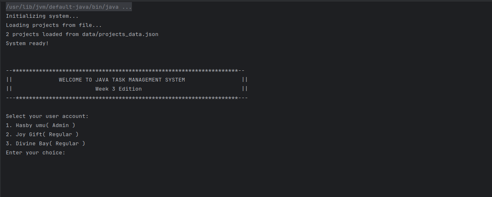
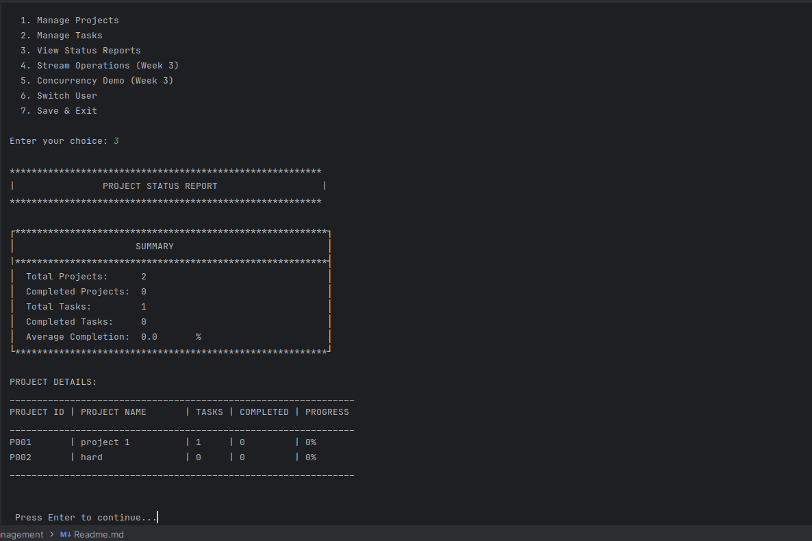
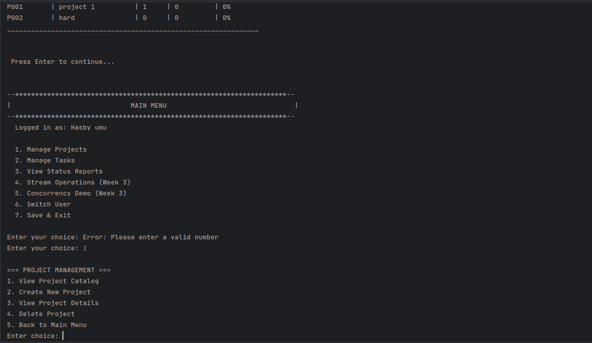

# Java Task Management System

A console-based task management application built with Java, demonstrating core OOP principles and Java features.

---

## 📋 Description

This project is a **Task Management System** that allows users to create projects, add tasks, track progress, and generate reports. Built as a learning project to demonstrate Java programming concepts including OOP, Collections, Streams, File I/O, and Concurrency.

---

## ✨ Features

- **Project Management** - Create, view, and delete Software/Hardware projects
- **Task Management** - Add, update, and remove tasks with status tracking
- **User Roles** - Admin and Regular users with different permissions
- **Status Reports** - View project completion statistics
- **Data Persistence** - Save and load projects from JSON file
- **Stream Operations** - Filter, group, and analyze data using Java Streams
- **Concurrency Demo** - Multi-threaded task updates demonstration

---

## 🛠️ Technologies Used

- **Java 17+**
- **JUnit 5** (Testing)
- **Git** (Version Control)

---

## 📁 Project Structure
```
Task Management/
├── Main.java                    # Application entry point
├── Controllers/                 # Handle user interactions
│   ├── ApplicationController.java
│   ├── ProjectController.java
│   ├── TaskController.java
│   ├── StreamController.java
│   └── ConcurrencyController.java
├── Models/                      # Data classes
│   ├── Project.java
│   ├── SoftwareProject.java
│   ├── HardwareProject.java
│   ├── Task.java
│   ├── User.java
│   ├── AdminUser.java
│   ├── RegularUser.java
│   └── StatusReport.java
├── Services/                    # Business logic
│   ├── ProjectService.java
│   ├── TaskService.java
│   ├── ReportService.java
│   ├── StreamService.java
│   ├── ConcurrencyService.java
│   └── ServiceContainer.java
├── Interfaces/                  # Contracts
│   ├── Completable.java
│   └── TaskFilter.java
├── utils/                       # Helper classes
│   ├── ConsoleMenu.java
│   ├── ValidationUtils.java
│   ├── RegexValidator.java
│   ├── FileUtils.java
│   └── exceptions/
│       ├── InvalidInputException.java
│       ├── ProjectNotFoundException.java
│       └── TaskNotFoundException.java
├── test/                        # JUnit tests
│   ├── ProjectTests.java
│   ├── TaskTests.java
│   ├── ValidationTests.java
│   ├── StreamOperationsTest.java
│   └── FilePersistenceTest.java
└── data/
    └── projects_data.json       # Saved data
```

---

## 🚀 Getting Started

### Prerequisites

- Java JDK 17 or higher
- Any Java IDE (IntelliJ IDEA, Eclipse, VS Code)

### Installation

1. **Clone the repository**
```bash
   git clone https://github.com/hasby-shanessa/task_management_lab3.git
```

2. **Open in your IDE**
    - Import as a Java project

3. **Run the application**
    - Run `Main.java`

---

## 💻 Usage

### Login
Select a user account to login:
```
1. [ADMIN] Hasby umu
2. [DEV] Joy Gift (QA)
3. [DEV] Divine Bay (Product)
```

### Main Menu
```
1. Manage Projects      - Create, view, delete projects
2. Manage Tasks         - Add, update, remove tasks
3. View Status Reports  - See project statistics
4. Stream Operations    - Week 3 stream demos
5. Concurrency Demo     - Week 3 threading demos
6. Switch User          - Change current user
7. Save & Exit          - Save data and exit
```

### Creating a Project
1. Select "Manage Projects" → "Create New Project"
2. Choose project type (Software/Hardware)
3. Enter project details
4. Optionally add tasks

### Task Status Options
- `Pending` - Not started
- `In Progress` - Currently working
- `Completed` - Finished

---

## 📚 Concepts Demonstrated

### Week 1-2: OOP Fundamentals
| Concept | Implementation |
|---------|----------------|
| **Classes & Objects** | Project, Task, User classes |
| **Inheritance** | SoftwareProject/HardwareProject extend Project |
| **Polymorphism** | User types with different permissions |
| **Encapsulation** | Private fields with getters/setters |
| **Abstraction** | Abstract User class, Completable interface |
| **Interfaces** | Completable, TaskFilter |

### Week 3: Advanced Java
| Concept | Implementation |
|---------|----------------|
| **Collections** | ArrayList for tasks, HashMap for projects |
| **Streams API** | filter(), map(), flatMap(), groupingBy() |
| **Lambdas** | `task -> task.isComplete()` |
| **Method References** | `Task::isComplete` |
| **File I/O (NIO)** | Files.readString(), Files.writeString() |
| **Regex** | Pattern matching for ID validation |
| **Concurrency** | ExecutorService, synchronized, parallelStream |

### Design Patterns & Principles
| Pattern/Principle | Implementation |
|-------------------|----------------|
| **SOLID** | Single responsibility controllers |
| **MVC Pattern** | Models, Controllers, Services separation |
| **Dependency Injection** | ServiceContainer |
| **Custom Exceptions** | ProjectNotFoundException, TaskNotFoundException |

---

## 🧪 Running Tests
```bash
# Run all tests in your IDE
# Or use command line:
java -jar junit-platform-console-standalone.jar --scan-classpath
```

### Test Coverage
- `ProjectTests.java` - Project creation, task management
- `TaskTests.java` - Task status, completion tracking
- `ValidationTests.java` - Input validation, exceptions
- `StreamOperationsTest.java` - Stream operations
- `FilePersistenceTest.java` - Save/load functionality

---

## 📸 Screenshots

### Welcome Screen
```

```

### Status Report
```

```
### Manage Projects
````

````
---

## 🔄 Git Workflow

This project was developed using feature branches:
```
main
├── feature/collections-refactor
├── feature/regex-validation
├── feature/file-persistence
├── feature/concurrency
├── feature/week3-tests
└── feature/main-integration
```

---

## 📝 What I Learned

1. **OOP Design** - How to structure code with classes, inheritance, and interfaces
2. **Collections vs Arrays** - ArrayList and HashMap provide flexibility and O(1) operations
3. **Streams** - Functional approach to data processing is cleaner than loops
4. **File Persistence** - NIO provides simple file read/write operations
5. **Concurrency** - Thread pools manage resources better than creating threads manually
6. **SOLID Principles** - Separating concerns makes code maintainable and testable
7. **Exception Handling** - Custom exceptions provide meaningful error messages

---

## 👤 Author

**Hasby Shanessa**

- GitHub: [@hasby-shanessa](https://github.com/hasby-shanessa)

---

## 📄 License

This project is for educational purposes as part of Java coursework.

---

## 🙏 Acknowledgments

- Java Documentation
- JUnit 5 Documentation